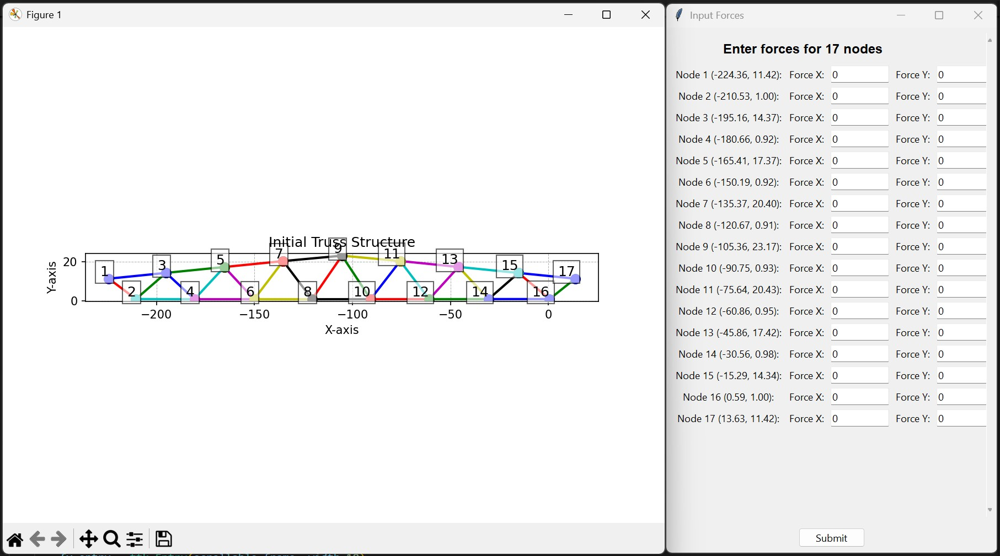
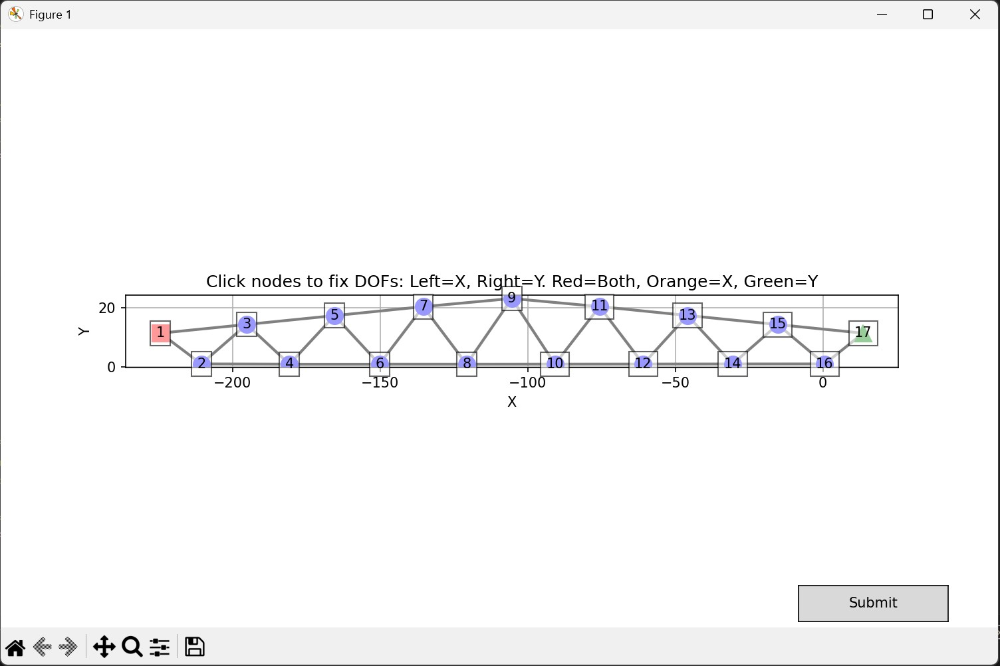

# fem-solver
# Mechanics of Solids: 2D Truss Analysis Tool

This project is a Python-based simulation tool for performing Finite Element Analysis (FEA) on 2D truss structures. It allows users to define loads and boundary conditions interactively to compute nodal displacements, as well as the internal stress and force within each truss member. The tool visualizes both the initial and the deformed structure.

This tool was originally developed as part of the coursework for **ES221 - Mechanics of Solids (Spring 2025)** and was later refactored for better readability and usability.

---

## Authors and Course Details

| Role      | Name             |
| :-------- | :--------------- |
| **Author** | Kavya Shah       |
| **Author** | Goraksh Bendale  |
| **Author** | Arnav Gogate     |
| **Author** | Apoorv Rane      |
| **Course** | ES221 - Mechanics of Solids |
| **Session** | Spring 2025      |

---

## 🚀 Features

* **Structure Visualization**: Plots the initial truss structure with labeled nodes.
* **Interactive Force Input**: A user-friendly GUI (`tkinter`) to apply forces (X and Y components) to each node.
* **Interactive Boundary Conditions**: An interactive plot (`matplotlib`) where users can click on nodes to apply fixed boundary conditions (fix X, Y, or both DOFs).
* **Finite Element Analysis**:
    * Calculates element stiffness matrices.
    * Assembles the global stiffness matrix for the entire structure.
    * Solves the system of equations $ [K]\{Q\} = \{F\} $ to find the global displacement vector $\{Q\}$.
* **Results Calculation**: Computes the axial stress and force for each element after solving for displacements.
* **Deformation Plotting**: Visualizes the deformed shape of the truss, overlayed on the original structure, with displacements scaled for clarity.

---

## 🔧 How to Run

### Requirements

Ensure you have the following Python libraries installed. You can install them using pip:

```bash
pip install numpy matplotlib
```
Note: ```tkinter``` is part of the standard Python library and typically does not require a separate installation.

### Execution
Save the code as a Python file (e.g., truss_analyzer.py).

Run the script from your terminal:

```Bash
python truss_analyzer.py
```

## 🛠️ Usage Workflow
Upon running the script, you will be guided through the following steps:

1. Initial Structure Plot: An initial ```matplotlib``` window appears, showing the truss structure with all nodes numbered. The console will print the calculated stiffness matrix for each element.

2. Force Input: A ```tkinter``` window titled "Input Forces" will open. Here, you can enter the forces in the X and Y directions for each node. By default, all forces are zero. Click Submit after entering the values.



4. Boundary Conditions: A new ```matplotlib``` window appears. In this interactive plot:

    - **Left-click** on a node to toggle its X-displacement constraint.

    - **Right-click** on a node to toggle its Y-displacement constraint.

    - Node colors indicate their status: **Blue** (Free), **Orange** (X-fixed), **Green** (Y-fixed), **Red** (Fully Fixed).

    - Click the **Submit** button on the plot when you are done.
  


5. Results in Console: After submitting the boundary conditions, the script will solve for the unknown displacements. The results, including the global displacement vector Q and the stress/force in each element, will be printed to the console.

6. Final Visualization: A final plot will be displayed, showing the original truss in blue and the deflected truss. The displacements are scaled by a factor (default is 10) to make the deformation visible.

## ⚙️ Code Structure
The code is organized into several key functions that handle different parts of the analysis process.

| Function Name                         | Description                                                                                         |
|--------------------------------------|-----------------------------------------------------------------------------------------------------|
| `calculate_angles_and_stiffness`     | Computes the angle and 4×4 stiffness matrix for each individual element.                           |
| `assemble_global_stiffness`          | Assembles the individual element matrices into a single global stiffness matrix for the structure. |
| `get_force_vector`                   | Creates the `tkinter` GUI for the user to input nodal forces.                                      |
| `apply_boundary_conditions_by_node`  | Creates the interactive `matplotlib` plot for setting boundary conditions and solves for displacements. |
| `calculate_element_results`          | Calculates the final axial stress and force in each member based on the nodal displacements.       |
| `plot_truss`                         | A utility function to draw the truss structure based on node coordinates and connectivity.          |
| `scaled_displacements`               | Calculates the new coordinates of the nodes after applying a scaling factor to the displacements.  |
